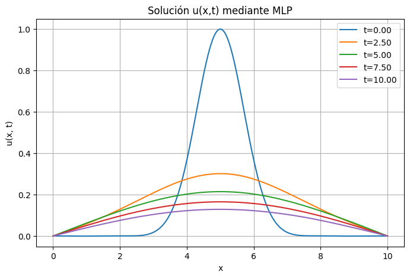
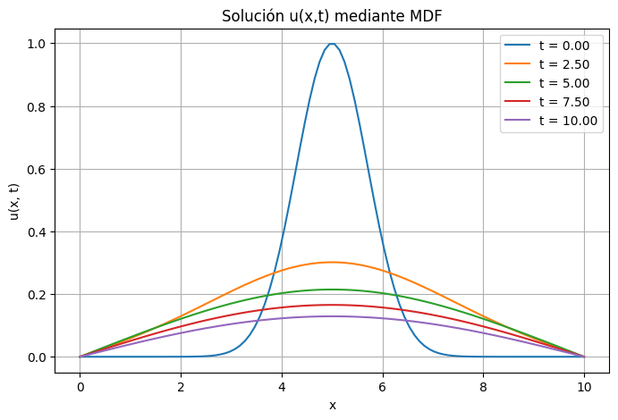
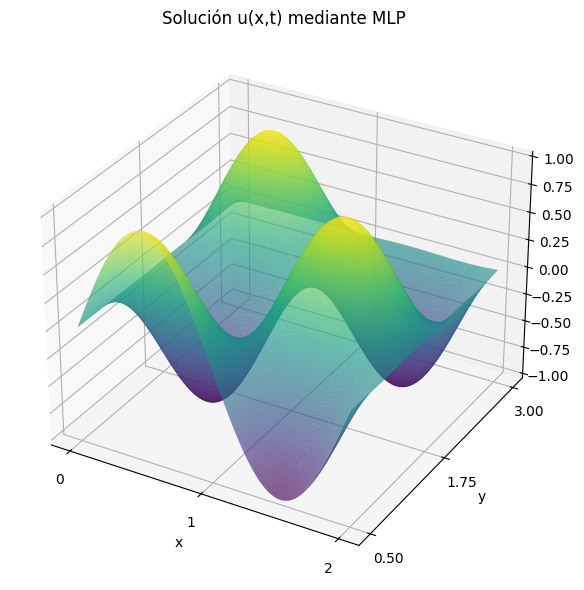
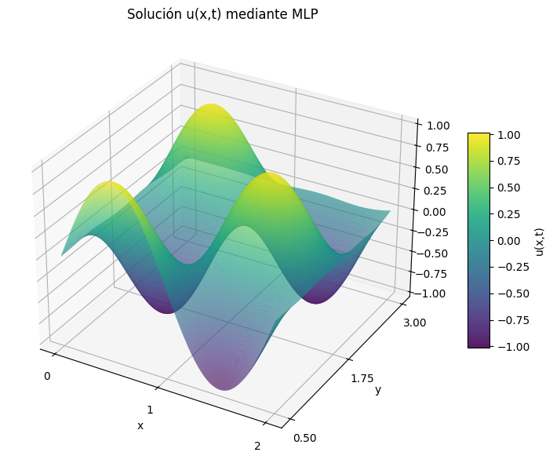
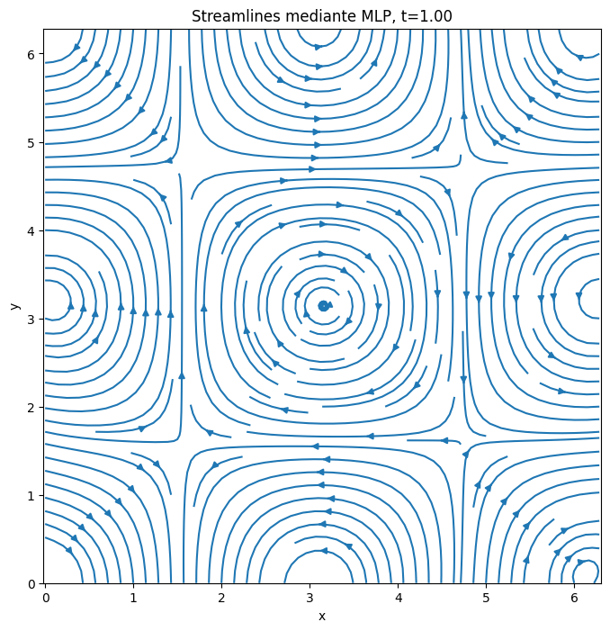
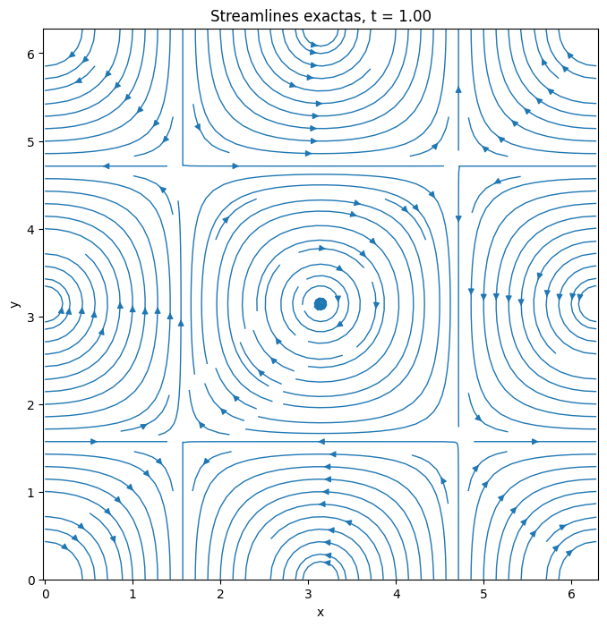
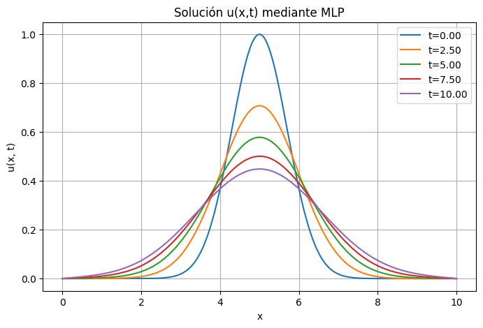
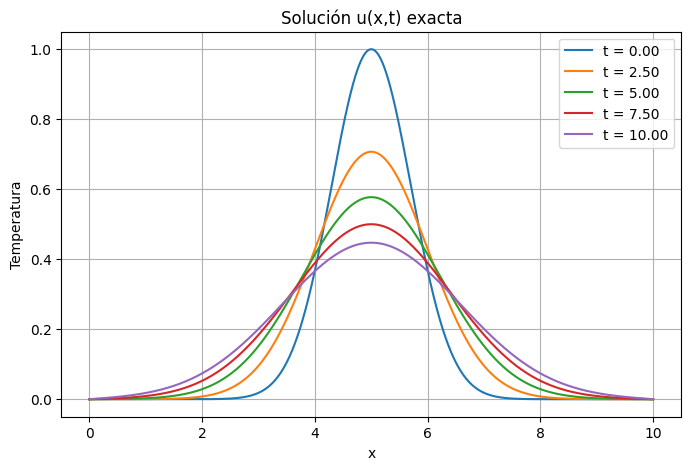
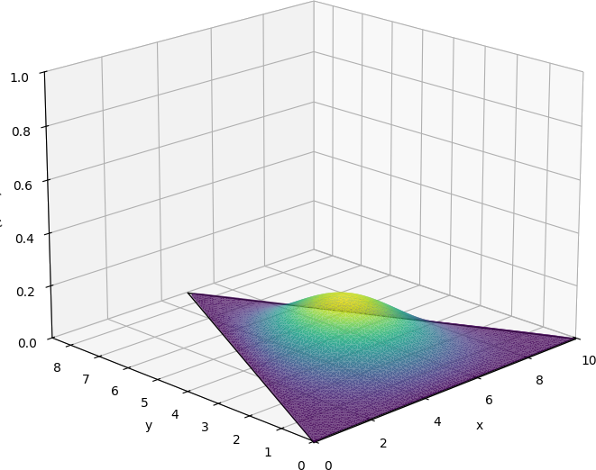
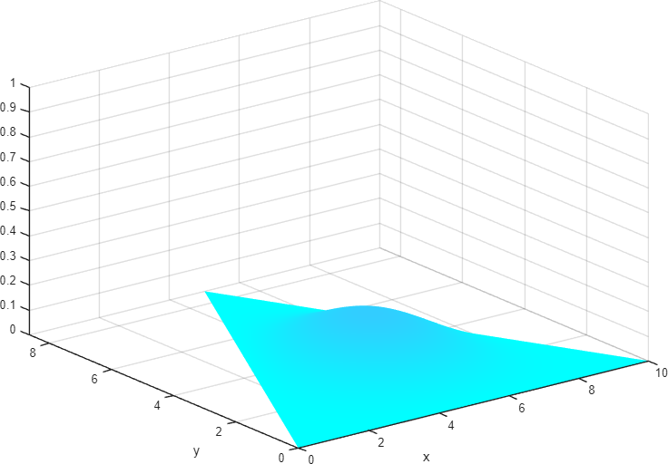

# Exploring the Utility of ANNs for Solving PDEs

This repository contains the code for various algorithms based on the Finite Difference Method (FDM) and Neural Networks (PINNs / MLPs) compared against each other to investigate the advantages and disadvantages of classical vs. modern scientific machine learning methods. A comprehensive analysis is presented in the bachelor thesis [report](<TFG_Matematicas_Alberto_Nieto_Cardoso.pdf>).

## Description

The PDE solving methods included in this project are:

- **_MDF:** Algorithms based on the Finite Difference Method (FDM).
- **_NN:** Algorithms based on Neural Networks, specifically Physics-Informed Multi-Layer Perceptrons (PINNs).

## Project Structure

- **[/models](/models):** Directory containing pre-trained model weights presented in the thesis.

<br />

- **[1 heat_1D_NN](<1 heat_1D_NN.ipynb>), [1 heat_1D_MDF](<1 heat_1D_MDF.ipynb>):** Notebooks dedicated to solving the 1D transient heat equation in space and time.
- **[2 poisson_2D_NN](<2 poisson_2D_NN.ipynb>), [2 poisson_2D_MDF](<2 poisson_2D_MDF.ipynb>):** Notebooks dedicated to solving the 2D Poisson equation with mixed Dirichlet and Neumann boundary conditions.
- **[3 taylor_green_2D_NN](<3 taylor_green_2D_NN.ipynb>), [3 taylor_green_2D_MDF](<3 taylor_green_2D_MDF.m>):** Code dedicated to solving the 2D Taylor–Green vortex problem (incompressible Navier–Stokes equations) with periodic boundary conditions.
- **[4 heat_alpha_1D_NN](<4 heat_alpha_1D_NN.ipynb>):** Parameterized PINN incorporating thermal diffusivity ($\alpha$) as an input dimension for multi-material generalization.
- **[5 heat_2D_NN](<5 heat_2D_NN.ipynb>):** 2D transient heat equation on an equilateral triangular domain, compared against MATLAB's FEM solver ([5 heat_2D_solvepde.mlx](<5 heat_2D_solvepde.mlx>)).

## Usage

1. Clone the repository (install [chocolatey](https://chocolatey.org/install) and [git](https://community.chocolatey.org/packages/Git) if needed):
   ```bash
   git clone https://github.com/albertotfgm/Alberto-Nieto-Cardoso-TFGM
   ```
2. Install all dependencies (Python 3.13):
   ```bash
   pip install -r requirements.txt
   ```
3. If an NVIDIA GPU with [CUDA support](https://developer.nvidia.com/cuda-gpus) is available, install PyTorch with CUDA support:
   ```bash
   pip3 install torch torchvision torchaudio --index-url https://download.pytorch.org/whl/cu128
   ```

## Results & Benchmarks

All benchmark experiments were conducted on an **AMD Ryzen 5 5600X CPU**, **32 GB RAM**, and an **NVIDIA GeForce RTX 3060 Ti GPU (8 GB VRAM, CUDA 12.8)**.

### 1. Neural Network Architecture & Activation Analysis
Four architectural variants were systematically evaluated across all PDE test cases:
1. **Model 1 (Weighted SIREN)**: Sine activation with loss multipliers ($\lambda_{\text{IC}}, \lambda_{\text{BC}} > 1$) prioritizing boundary and initial conditions.
2. **Model 2 (Standard SIREN)**: Pure sinusoidal activation functions without boundary weighting ($\lambda=1$).
3. **Model 3 (Tanh)**: Hyperbolic tangent activation functions.
4. **Model 4 (ReLU)**: Standard Rectified Linear Unit activations.

> [!NOTE]
> **Key Finding**: Piecewise-linear activations (ReLU) completely fail for higher-order differential operators because their second-order autograd derivative is zero almost everywhere ($\nabla^2 \text{ReLU}(x) = 0, \forall x \neq 0$). Smooth $C^\infty$ activations (Sine / Tanh) are strictly required.

---

### 2. 1D Transient Heat Equation
Solving $\partial_t u = \alpha \partial_{xx} u$ on $[0,10]\times[0,10]$ with Gaussian initial profile $u(x,0) = e^{-(x-5)^2}$ and homogeneous Dirichlet BCs.

| Time $t$ (s) | PINN MSE ($10^4 \times 10^4$ Grid) | FDM Crank-Nicolson MSE |
| :---: | :---: | :---: |
| **0.0** | $2.7 \times 10^{-7}$ | $1.2 \times 10^{-24}$ |
| **2.5** | $1.6 \times 10^{-8}$ | $5.4 \times 10^{-19}$ |
| **5.0** | $1.9 \times 10^{-8}$ | $2.7 \times 10^{-19}$ |
| **7.5** | $1.1 \times 10^{-8}$ | $3.5 \times 10^{-19}$ |
| **10.0** | $8.4 \times 10^{-9}$ | $3.8 \times 10^{-19}$ |

- **Execution Time**: FDM Crank-Nicolson solved the $10^8$-point domain in **27 seconds**. PINN required **19 minutes** of GPU training.
- **Trade-off**: While FDM is faster for fixed 1D structured grids, the trained PINN acts as a continuous, differentiable surrogate function that evaluates off-grid points instantly without interpolation error.

<p align="center">
  
  
</p>
<p align="center"><em>Figure 1: Approximate PINN solution (left) vs. Exact analytical Fourier series solution (right) across time snapshots.</em></p>

---

### 3. 2D Elliptic Poisson Equation (Mixed Boundary Conditions)
Solving $-\Delta u = 2\pi^2 \sin(\pi x)\cos(\pi y)$ on $[0,2]\times[0.5,3]$ with Dirichlet conditions on three edges and Neumann condition $-\partial_y u(x, 0.5) = 0$ on the south edge.

- **FDM Memory Bottleneck**: 5-point discrete Laplacian matrix storage and solving capped spatial resolution at $N = 200$ ($200 \times 200$ grid). Attempting $N \ge 300$ caused kernel crashes due to RAM exhaustion.
- **PINN Resolution Independence**: The PINN evaluated an ultra-dense $2000 \times 2000$ grid ($4 \times 10^6$ points) with minimal memory footprint, achieving **$\text{MSE} = 1.63 \times 10^{-6}$** compared to FDM's **$\text{MSE} = 1.27 \times 10^{-4}$**.

<p align="center">
  
  
</p>
<p align="center"><em>Figure 2: FDM discrete solution at 200x200 (left) vs. High-resolution PINN solution evaluated at 2000x2000 (right).</em></p>

---

### 4. 2D Incompressible Navier–Stokes: Taylor–Green Vortex
Solving the vorticity transport equation on $[0, 2\pi]^2$ with periodic boundary conditions via streamfunction parameterization $\psi$ ($u = -\partial_y \psi, v = \partial_x \psi$, guaranteeing $\nabla \cdot \mathbf{u} = 0$).

| Time $t$ (s) | PINN Vorticity MSE ($200 \times 200$) |
| :---: | :---: |
| **0.00** | $2.9 \times 10^{-6}$ |
| **0.25** | $2.2 \times 10^{-4}$ |
| **0.50** | $5.4 \times 10^{-4}$ |
| **0.75** | $7.8 \times 10^{-4}$ |
| **1.00** | $1.1 \times 10^{-3}$ |

- **MATLAB FDM Reference**: Artificial compressibility scheme with periodic Kronecker operators achieved **$\text{MSE} = 1.7 \times 10^{-9}$** in 7.5 minutes.
- **PINN Feature**: Automatic exact satisfaction of the divergence-free condition without pressure-velocity Poisson projection steps.

<p align="center">
  
  
</p>
<p align="center"><em>Figure 3: PINN velocity streamlines (left) and vorticity contour field $\omega(x,y,t=1.0)$ (right).</em></p>

---

### 5. Parameterized PINN: Thermal Diffusivity $\alpha \in [0, 2]$
The thermal diffusivity parameter $\alpha$ was incorporated as an active third input coordinate $(x, t, \alpha) \mapsto u$. A single neural network model learned the entire physical family of heat diffusion behaviors simultaneously without retraining.

| Time $t$ (s) | $\alpha = 0.1$ | $\alpha = 1.0$ | $\alpha = 1.9$ |
| :---: | :---: | :---: | :---: |
| **0.0** | $4.3 \times 10^{-8}$ | $2.2 \times 10^{-8}$ | $1.9 \times 10^{-8}$ |
| **2.5** | $1.0 \times 10^{-7}$ | $8.0 \times 10^{-9}$ | $1.5 \times 10^{-8}$ |
| **5.0** | $3.1 \times 10^{-7}$ | $6.7 \times 10^{-9}$ | $1.1 \times 10^{-8}$ |
| **7.5** | $4.3 \times 10^{-7}$ | $1.4 \times 10^{-8}$ | $4.1 \times 10^{-8}$ |
| **10.0** | $9.3 \times 10^{-7}$ | $1.2 \times 10^{-8}$ | $5.9 \times 10^{-8}$ |

<p align="center">
  
  
</p>
<p align="center"><em>Figure 4: Parameterized PINN solution across contrasting thermal diffusivity regimes ($\alpha=0.1$ vs. $\alpha=1.0$).</em></p>

---

### 6. Complex Geometry: Triangular Domain 2D Heat Equation
Solving transient heat diffusion on an equilateral triangular domain $L=10$ with Dirichlet boundary conditions using uniform barycentric sampling and edge parameterization.

- **Benchmark**: MATLAB PDE Toolbox Finite Element Method (`solvepde`).
- **Accuracy**: $\text{MSE}(t=0.0) = 2.2 \times 10^{-7}$, $\text{MSE}(t=0.5) = 4.7 \times 10^{-8}$, $\text{MSE}(t=1.0) = 1.0 \times 10^{-7}$.
- **Advantage**: Bypasses the complex mesh generation algorithms required by FEM; training points are sampled directly from parametric coordinate transforms.

<p align="center">
  
  
</p>
<p align="center"><em>Figure 5: PINN solution on triangular domain at $t=1.0$ (left) vs. MATLAB FEM solvepde benchmark (right).</em></p>

---

## Conclusions

1. **Computational Speed vs. Flexibility**:
   - **Classical FDM/FEM** remains undefeated in single-run execution speed and asymptotic convergence order when the domain is regular and the discretized sparse matrix fits comfortably in RAM.
   - **PINNs** trade off upfront training time for continuous, differentiable solution representations and instant off-grid inference.
2. **Mitigating the Curse of Dimensionality & Memory Constraints**:
   - Classical grid methods suffer from $\mathcal{O}(N^d)$ exponential scaling in memory footprint, causing out-of-memory crashes on dense 2D/3D grids (e.g., FDM Poisson at $N \ge 300$).
   - PINNs decouple model parameter count from spatial sampling density, allowing memory-efficient evaluation across millions of collocation points.
3. **Parametric & Geometric Adaptability**:
   - PINNs excel when solving parameterized PDE families (e.g. variable physical constants $\alpha$), learning an entire solution manifold with a single model.
   - Non-standard geometries (such as triangular domains) are accommodated through coordinate sampling without the overhead of generating body-fitted unstructured meshes.
4. **Activation Functions**:
   - Trigonometric activations (SIREN) and hyperbolic tangents (Tanh) are mandatory for PDE physics. Standard ReLU activations collapse due to vanishing second-order gradients.

